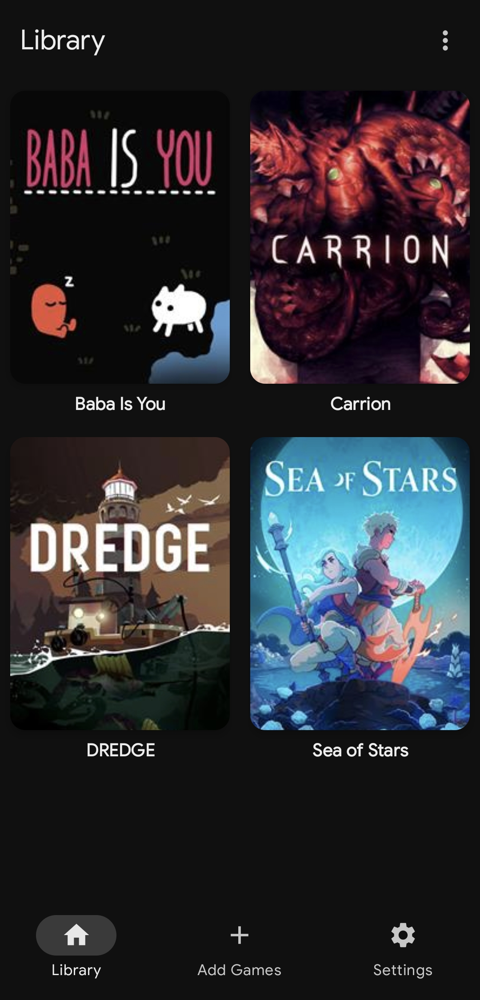
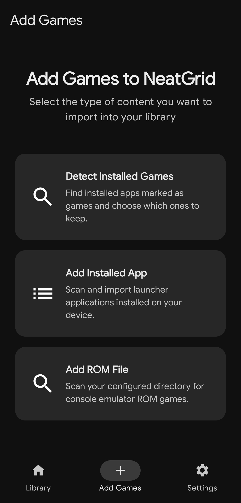

# NeatGrid

NeatGrid is an Android game launcher and frontend for keeping installed games and emulator ROMs in one library. It is built with Kotlin, Jetpack Compose, and Material 3.

The app is intended for people who use a mix of native Android games and external emulators and want a cleaner way to browse and launch them.

## Screenshots

| Library | Add Games |
| --- | --- |
|  |  |

## Features

- A single library for installed Android games and ROM files
- Automatic detection of apps marked as games by Android
- A review screen for choosing which detected games to add or exclude
- Automatic removal of library entries when an installed game is uninstalled
- Reversible hiding with a separate hidden-games list
- ROM folder scanning through Android's Storage Access Framework
- ROM launching through compatible installed emulators
- Missing-ROM detection with an option to preserve or remove accessible save files
- Cover art, descriptions, ratings, genres, release dates, and screenshots from the LaunchBox Games Database
- Manual metadata matching and editing when the automatic result is wrong
- Library sorting by title or platform
- Adjustable grid density
- Light, dark, dynamic color, and AMOLED black themes

## Requirements

- Android 7.0 or newer
- Android Studio with Android SDK 36 installed
- JDK 17 or newer

## Building

Clone the repository and open it in Android Studio:

```bash
git clone https://github.com/vnumex/NeatGrid.git
cd NeatGrid
```

To build a debug APK from the command line:

```powershell
.\gradlew.bat assembleDebug
```

On macOS or Linux:

```bash
./gradlew assembleDebug
```

The APK is written to `app/build/outputs/apk/debug/app-debug.apk`.

## ROMs and save files

NeatGrid does not include an emulator. A compatible emulator must already be installed for a ROM to launch.

Folder access is granted through Android's system file picker. NeatGrid can manage related save or state files only when they are visible inside the selected folder. Files stored in an emulator's private app directory remain controlled by that emulator.

## Metadata

Game metadata is fetched from the LaunchBox Games Database and cached locally. Metadata can be refreshed, matched to a different result, or edited manually from the game details screen.

## License

NeatGrid is available under the [MIT License](LICENSE).
